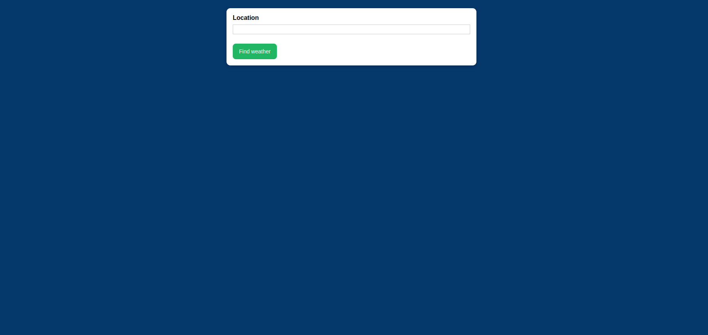
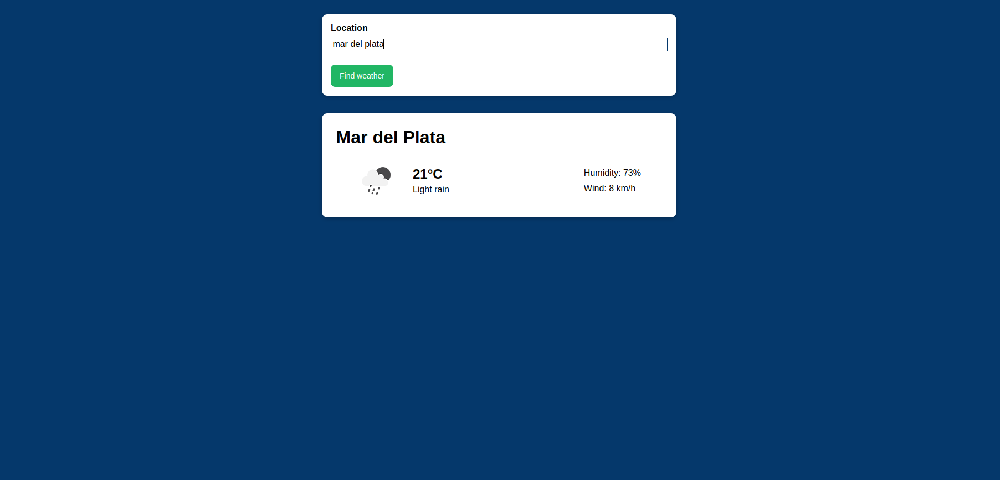
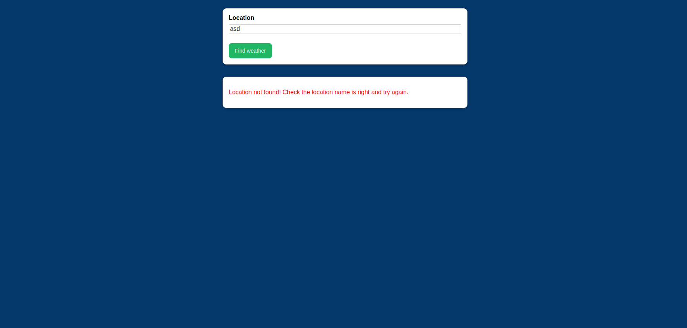
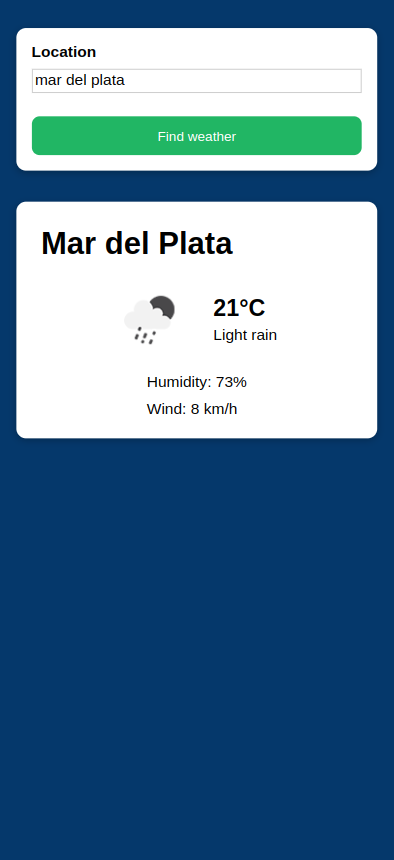

# Weather App - Demo - React
This website will show you the current weather conditions of the entered location. It pulls the data from [OpenWeather](https://openweathermap.org/).

You can check it out working [here](https://aon.github.io/weather-app-react-demo/).

The main learning goals for this project were:
- Learn how to handle more complex API calls
- Learn how to handle error returns from API
- Build a simple responsive interface
- Keep improving my React skills

## Screenshots 📷

## Built with 🛠️
- JavaScript
- HTML
- CSS
- React

## Authors ✒️
- Agustin Aon - [@aon](https://github.com/aon)
